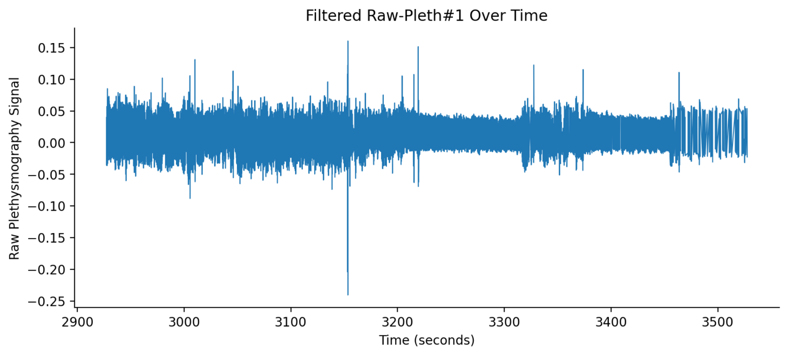

# Mouradian_noise_filter

## Step 1: Download Necessary Files from Repository 
### 1. ML Model: finalv2.keras
### 2. Model Scalar: scaler.pkl
### 3. Model Features: feature_columns.pkl

## Step 2: Go to Noise Filter APP Webpage -> https://mouradiannoisefilter-c5ygv7f7gwphfaeeubsa9f.streamlit.app/#6f21c79a

## Step 3: Upload necessary files, including you chosen plethysmography data exported as a CSV file 

## Step 4: Run Model!! 
  ### 📈 Example Output

  

  The plot shows the cleaned signal over time after noise removal.

## Step 5: If filtering is satisfactory press "Download Cleaned CSV" to have cleaned data saved to local computer
